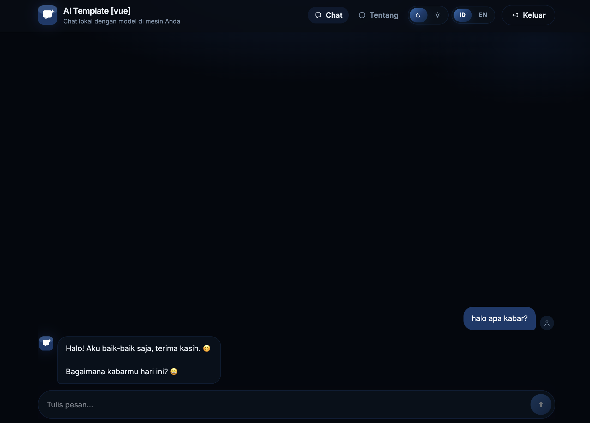

# Template AI lokal

README Bahasa Indonesia. [English](README.md)



**Panduan langkah demi langkah:** Dokumentasi yang mudah diikuti di [https://ai.teristimewa.com/](https://ai.teristimewa.com/)

**Video tutorial:** Cara setup AI sendiri dari template ini.

<video controls width="100%" src="https://github.com/KutuGondrong/ai-template-teristimewa/releases/download/readme-video/how-to-make-your-own-ai.mp4"></video>

## Yang perlu dipasang dulu

Pasang ini di mesin **sebelum** clone repo.

| Tool | macOS | Windows | Linux |
|---|---|---|---|
| Git | `xcode-select --install` atau git-scm | Git for Windows | `sudo apt install git` |
| **Docker** (wajib) | Docker Desktop | Docker Desktop | Engine + plugin Compose |
| Volta + Node 22 + pnpm | `curl https://get.volta.sh \| bash` lalu `volta install node@22` dan `volta install pnpm` | installer volta.sh | sama seperti macOS |
| uv + Python 3.12 | `curl -LsSf https://astral.sh/uv/install.sh \| sh` lalu `uv python install 3.12` | installer PowerShell uv | sama seperti macOS |
| Make | CLT atau `brew install make` | WSL2: `sudo apt install make` | `sudo apt install make` |
| IntelliJ IDEA + JDK 21 | hanya untuk Spring; JDK 21 bisa diunduh dari IntelliJ | sama | sama |

Cek: `git --version`, `docker --version`, `docker compose version`, `node --version`, `pnpm --version`, `uv --version`, `make --version`.

`make clone`, `make run`, `make install`, `make test`, dan `make test-e2e` menampilkan cek tool dulu. Log menampilkan OS (macOS, Linux, Windows, atau WSL) dan menandai tiap tool **OK**, **NEED**, atau **SKIP**. Kalau Volta, Node 22, pnpm 11.17.0, uv, Python 3.12, Docker, rsync, atau (untuk Spring) IntelliJ IDEA dan JDK 21 kurang / versinya salah, proses berhenti dan menampilkan perintah pasang untuk OS itu.

Docker harus **menyala** sebelum `make clone` / `make run`.

Untuk Spring, buka project Spring di IntelliJ IDEA lalu pilih **File → Project
Structure → SDK → Download JDK** dan gunakan versi 21. Pilih JDK yang sama di
**Settings → Build Tools → Gradle → Gradle JVM**. Script otomatis mencari JDK
yang diunduh IntelliJ di `~/.jdks`. SDKMAN adalah version manager Java seperti
Volta/FVM, tetapi tidak wajib.

## Setelah punya template ini

Tanpa clone, `make run` memakai stack default: **local** + **nuxt** + **deepseek-r1-1.5b** + **python**.

```bash
make run
```

Itu install stack itu kalau perlu, lalu start docker + backend + frontend.

Kalau mau ganti-ganti frontend (Nuxt / Next / Vue / React) tanpa restart Docker dan backend:

```bash
make run local no-fe deepseek-r1-1.5b python
make run-fe nuxt
```

`Ctrl+C` di `make run-fe` hanya stop UI itu. Lanjut `make run-fe next` (atau `vue` / `react`). `Ctrl+C` di `make run … no-fe` stop backend. `make down` stop Docker.

Argumen yang sama untuk test dan smoke (biarkan backend + frontend jalan di terminal lain untuk e2e/smoke):

```bash
make test
make test-e2e
make smoke
make down
```

Combo lain di template ini — env langsung setelah perintah:

```bash
make run local nuxt deepseek-r1-1.5b python
make test local nuxt deepseek-r1-1.5b python
make test-e2e local nuxt deepseek-r1-1.5b python
make smoke local nuxt deepseek-r1-1.5b python
```

Kalau mau salin combo ke **folder baru sejajar template ini** (`../<app-name>`), clone dulu, lalu `cd` ke folder itu dan `make run` di sana:

```bash
make clone nuxt deepseek-r1-1.5b python my-ai-chat
cd ../my-ai-chat
make run
```

Contoh: template di `…/ai/ai-template-teristimewa`, app clone di `…/ai/my-ai-chat`. Jangan `make run my-ai-chat` dari folder template.

Tanpa Make: `./scripts/run.sh`, atau `./scripts/run.sh local nuxt deepseek-r1-1.5b python`, atau `./scripts/run.sh local no-fe deepseek-r1-1.5b python` lalu `./scripts/run-fe.sh nuxt`. Setelah clone: `cd ../my-ai-chat` dan `./scripts/run.sh`.

`make clone` tidak mengubah nama folder template. Combo ditulis ke `Makefile` app baru, stack itu di-install, model Docker di-pull, dan **README app baru diganti** supaya hanya menjelaskan frontend, backend, dan Docker itu. Tidak start FE/BE.

Tidak ada `make dev`. Di folder hasil clone, `make run` memakai env **local**. Pilih env setelah clone:

```bash
make run local
make run dev
make run prod
make test local
make test-e2e local
make smoke local
```

Isi file env masih sama. Tiap service tetap punya file `local` / `dev` / `prod` sendiri.

FE: `nuxt` | `next` | `vue` | `react` | `no-fe` (backend saja; lalu `make run-fe`)  
LLM: `deepseek-r1-1.5b` | `qwen2.5-0.5b` | `qwen2.5-1.5b` | `llama3.2-1b` | `gemma2-2b`  
BE: `python` | `spring`

Nama app: mulai dengan huruf; huruf, angka, hyphen, atau underscore (contoh: `my-ai-chat`).

Buka UI di **http://127.0.0.1:5174** (react), **5173** (vue), atau **3000** (nuxt/next). Swagger API: http://127.0.0.1:8000/docs di local/dev. Prod tidak punya Swagger; pakai http://127.0.0.1:8000/api/health.

### Port dev & CORS

Chat dan LLM lewat **backend port 8000** (Ollama di 11434 di Docker), bukan lewat port UI. Dev server bind ke **127.0.0.1**; API default **http://127.0.0.1:8000** (supaya cookie session jalan).

Port dev default sudah ada di CORS backend (3000, 5173, 5174 — masing-masing `localhost` dan `127.0.0.1`). Kalau chat gagal setelah ganti frontend, **restart backend** (`Ctrl+C` lalu `make run … no-fe` lagi). `make run-fe` akan menolak start kalau CORS backend belum cocok.

| Frontend | URL dev |
|---|---|
| nuxt, next | http://127.0.0.1:3000 |
| vue | http://127.0.0.1:5173 |
| react | http://127.0.0.1:5174 |

Kalau UI jalan di **port lain** (mis. `pnpm dev -- --port 3001`), tambahkan origin itu ke **CORS** backend — kalau tidak, browser akan blokir panggilan API.

**Python** (`backend/python/<slug>/`):

- `settings.yaml` atau `settings.local.yaml` — tambah di `cors_origins`:

```yaml
cors_origins:
  - "http://localhost:3001"
  - "http://127.0.0.1:3001"
```

- atau `.env.local` — `CORS_ORIGINS` sebagai array JSON:

```bash
CORS_ORIGINS='["http://localhost:3001","http://127.0.0.1:3001"]'
```

**Spring** — tambah URL yang sama di `backend/spring-boot/<slug>/src/main/kotlin/com/teristimewa/ai/api/WebConfig.kt` (`.allowedOrigins(...)`).

Restart backend setelah ubah CORS.

Stop: `make down` di folder yang sama tempat `make run`. App clone lain: dari template ini, `make clone … other-ai-chat`, lalu `cd` ke folder sejajar itu.

`make install` di template ini meng-install semua frontend dan python backend. Tidak wajib sebelum `make run` / `make clone`; perintah itu meng-install hanya stack yang dipilih.

RAM: qwen 0.5b ~8 GB; 1.5b / llama ~8–12 GB; deepseek ~12 GB; gemma2-2b ~16 GB.

## Perintah

Sama seperti README English: `make run`, `make run-fe`, `make test`, `make test-e2e`, `make smoke`, `make down` (argumen `make run` sama: kosong, atau `<env> <fe|no-fe> <slug> <be>`). Setelah clone: `cd ../<app-name>` lalu `make run` / `make run local|dev|prod` / `make run-fe` dan perintah test yang sama.

Playwright dan smoke check: biarkan `make run` jalan di terminal lain.

## Env

Tidak ada `.env` di root. Tiap service punya `local` / `dev` / `prod` (isinya sama dulu) dan `.gitignore`-nya sendiri:

- Frontend: `frontend/<app>/.env.local.example` / `.env.dev.example` / `.env.prod.example`
- Python: `settings.yaml`, `settings.{local,dev,prod}.yaml`, `.env.*.example`
- Spring: `application.yml` dan `application-{local,dev,prod}.yml`
- `.gitignore` di root hanya untuk sisa `package.json` root (`/node_modules/`, `/.pnpm-store/`)
- Halaman about LLM: `frontend/<app>/llm/<slug>.json`. `make clone` / `make run` hanya menulis ulang `public/llm.active.json` di frontend yang dipilih
